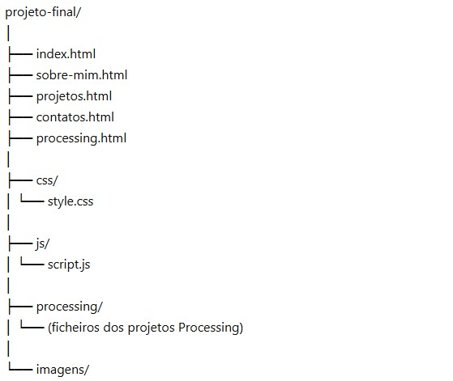

# Projeto_final
Portefólio
# projeto-final
Projeto final da UC - Laboratório de Projeto II

## Descrição
O projeto final tem como objetivo a criação de um portfólio, tendo como base os trabalhos desenvolvidos ao longo da licenciatura.

Os trabalhos desenvolvidos na linguagem **Processing** devem estar organizados na página `processing.html`, sendo apresentados nos respetivos **canvas**.

As páginas `index.html`, `sobre-mim.html`, `projetos.html` e `contactos.html` são de conteúdo livre, sendo definidas pelos autores do projeto.

---

## Objetivos
- Desenvolver um website pessoal (portfólio);
- Organizar e apresentar trabalhos académicos;
- Aplicar conhecimentos de HTML, CSS e JavaScript;
- Integrar projetos desenvolvidos em Processing.

## Tecnologias Utilizadas
- HTML5  
- CSS3  
- JavaScript  
- Processing  

---

## Páginas do Website

- **index.html** → Página inicial  
- **sobre-mim.html** → Informação sobre o autor  
- **projetos.html** → Apresentação dos trabalhos desenvolvidos em subpáginas
- **contactos.html** → Contactos do autor  
- **processing.html** → Projetos desenvolvidos em Processing (com canvas)

## Subpaginas de projetos do Website

- **projetos_Fotografia.html** → Apresentação dos trabalhos de fotografia
- **projetos_Video.html** → Apresentação dos trabalhos de VÍdeo
- **projetos_UX/UI.html** → Apresentação dos trabalhos de UX/UI
## Estrutura do Projeto

## Autor
- Marta Carola

## Ano Letivo
- 2025/2026

## Unidade Curricular
- Laboratório de Projeto II